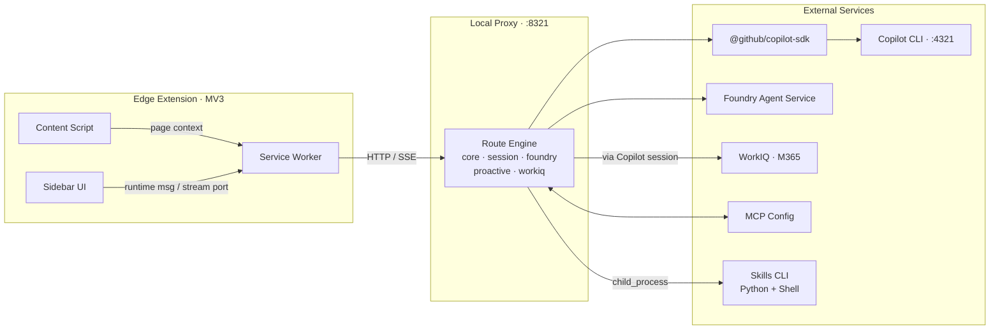
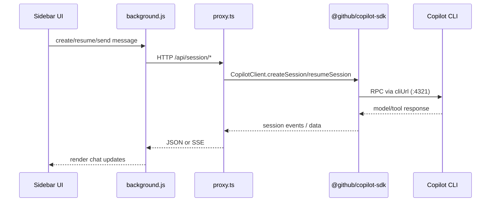

# IQ Copilot Edge Extension

> Edge sidebar AI assistant integrating GitHub Copilot, Foundry IQ, Work IQ, and Fabric IQ.

---

## Table of Contents

- [IQ Copilot Edge Extension](#iq-copilot-edge-extension)
  - [Table of Contents](#table-of-contents)
  - [Product Overview](#product-overview)
  - [Architecture](#architecture)
  - [Copilot SDK Flow](#copilot-sdk-flow)
  - [Business Impact and Core Capabilities](#business-impact-and-core-capabilities)
    - [Business outcomes](#business-outcomes)
    - [Core capabilities (detailed)](#core-capabilities-detailed)
  - [Bring-Your-Own Prerequisites](#bring-your-own-prerequisites)
    - [Foundry / WorkIQ / Fabric IQ preparation](#foundry--workiq--fabric-iq-preparation)
  - [Quick Start Local](#quick-start-local)
  - [How to Use the Edge Extension](#how-to-use-the-edge-extension)
  - [Fast Local Environment for Testing](#fast-local-environment-for-testing)
    - [A) Quick smoke validation](#a-quick-smoke-validation)
    - [B) Full E2E flow](#b-full-e2e-flow)
    - [Stability flags](#stability-flags)
  - [Project Structure](#project-structure)
  - [Development Commands](#development-commands)
  - [Documentation](#documentation)
  - [Security and Responsible AI](#security-and-responsible-ai)
  - [License](#license)

---

## Product Overview

IQ Copilot is an **Edge MV3 sidebar assistant** that connects a local HTTP proxy to GitHub Copilot CLI and enterprise AI services.

| IQ Platform | Core Capability |
|-------------|-----------------|
| **Foundry IQ** | Enterprise knowledge agents for manuals, troubleshooting, and spec Q&A |
| **Work IQ** | Microsoft 365 data access for Mail, Calendar, Teams, and OneDrive |
| **Fabric IQ** | Structured specification filtering and comparison |

It uses **`@github/copilot-sdk`** as a first-class runtime dependency for session lifecycle and streaming orchestration.

---

## Architecture



---

## Copilot SDK Flow



Key implementation points:

- `src/proxy.ts` creates and manages `CopilotClient`.
- `src/routes/session.ts` uses SDK session APIs (`createSession`, `resumeSession`, streaming).
- `src/shared/types.ts` and route modules use SDK types (`CopilotSession`, `CopilotClient`).

---

## Business Impact and Core Capabilities

### Business outcomes

- **Proactive daily WorkIQ updates** provide morning summaries, pending actions, and follow-up reminders.
- **Multi-tab and multi-session workflows** enable faster parallel lookup across different topics and models.
- **Edge extension-first UX** integrates into existing browsing workflows and supports quick screenshot-based queries.
- **Foundry integration** connects enterprise agents across Foundry IQ and Fabric IQ scenarios.
- **MCP extensibility** allows teams to connect their own tools and knowledge endpoints.


### Core capabilities (detailed)

| Capability | What It Does | Practical Value |
|------------|---------------|-----------------|
| **Smart Chat + Page Context** | Uses page context, files, and prompts for summaries, analysis, translation, and drafting | Faster understanding and response preparation |
| **Multi-Tab Sessions** | Runs up to 10 isolated chats with per-tab model and skill context | Parallel task handling without cross-talk |
| **PKM Q&A** | Answers product FAQ-style questions with **PKM Agent + Azure AI Search** | Faster issue clarification and support response |
| **UM Lookup** | Performs user-manual metadata lookup with **UM Agent + Azure AI Search** | More accurate manual navigation and retrieval |
| **Specification Query** | Queries structured product spec data with **Fabric Agent + Fabric Data Agent** | Better pre-sales comparison and technical validation |
| **WorkIQ + Proactive Scan** | Queries Microsoft 365 and generates proactive briefings/reminders | Better execution on meetings, deadlines, and follow-ups |
| **MCP Integrations** | Connects external tool servers (for example Docs and SDK references) | Single UI for internal + external intelligence |
| **Screenshot Query + Prompt Assets** | Captures page screenshots, standardizes prompts, tracks usage, and preserves session history | Faster context handoff and repeatable team workflows |

---

## Bring-Your-Own Prerequisites

Prepare the following before running the project:

- **Node.js 20+**
- **Microsoft Edge 90+** (MV3 support)
- **GitHub Copilot CLI**, authenticated: `copilot auth login`
- **Azure CLI**, authenticated: `az login` (required for Foundry Agent and image-generation skills)
- Recommended for E2E: `npx playwright install chromium`

### Foundry / WorkIQ / Fabric IQ preparation

- Provision and validate Foundry agents (for example `um-semantic-agent`, `pkm-semantic-agent`, `fabric-specs-agent`).
- Configure Foundry endpoint and authentication (API key or Azure identity).
- Create `.github/skills/foundry_agent_skill/.env` from `.env.example` when using local skill scripts.
- Ensure enterprise WorkIQ/Fabric IQ data sources are accessible to the configured agents.

---

## Quick Start Local

```bash
# 1) Install dependencies
npm install

# 2) Install Playwright browser (first run)
npx playwright install chromium

# 3) Start Copilot CLI + local proxy
./start.sh

# 4) Verify health
curl http://127.0.0.1:8321/api/ping
```

The local proxy is expected at `http://127.0.0.1:8321`.

---

## How to Use the Edge Extension

1. Open `edge://extensions`.
2. Enable **Developer mode**.
3. Click **Load unpacked** and select the repository root.
4. Open any webpage and launch the Edge side panel.
5. Use chat and slash commands:
    - `/help`
    - `/workiq <query>`
    - `/foundry_agent_skills <agent-name> to check <query>`
    - `/model list` and `/model use <model-id>`

---

## Fast Local Environment for Testing

### A) Quick smoke validation

```bash
./start.sh
npm run lint
npm run typecheck
npm run test:unit
```

### B) Full E2E flow

```bash
# keep proxy running in another terminal
./start.sh

# run all Playwright tests
npx playwright test

# run a single spec
npx playwright test tests/extension.spec.js
```

### Stability flags

```bash
npx playwright test --workers=1 --timeout=180000 --reporter=list
```

---

## Project Structure

```
├── src/
│   ├── sidebar.*          # Extension UI (HTML/CSS/JS)
│   ├── background.js      # MV3 Service Worker
│   ├── content_script.js  # Page context capture
│   ├── proxy.ts           # Local HTTP Proxy entry
│   ├── lib/               # Frontend modules
│   ├── routes/            # core / session / foundry / proactive / workiq
│   └── shared/            # Shared contracts and types
├── tests/                 # Playwright + Vitest
├── docs/                  # Additional docs and archive
└── .github/skills/        # Local skill scripts
```

---

## Development Commands

| Command | Description |
|---------|-------------|
| `./start.sh` | Start Copilot CLI + proxy |
| `npm run lint` | ESLint |
| `npm run typecheck` | TypeScript type check |
| `npm run test:unit` | Vitest unit tests |
| `npm test` | Full test suite |
| `npm run build` | Build proxy bundle |

---

## Documentation

| Document | Description |
|----------|-------------|
| [TECH.md](./TECH.md) | Consolidated technical guide (Architecture + CI/CD + E2E) |
| [Demo Script](./docs/DEMO.md) | Demo prompts and scenario flow |

---

## Security and Responsible AI

- **Local-first network boundary**: proxy listens only on `localhost`.
- **Least privilege extension model**: only required MV3 permissions are enabled (`activeTab`, `sidePanel`, `tabs`, `storage`, `alarms`).
- **Input and payload protection**: Zod validation + request body size limits.
- **Sensitive data handling**: key/token redaction in logs and runtime-scoped storage strategy.
- **Enterprise protection with Foundry Agent Service**:
   - Foundry agent workloads are routed through Microsoft-managed service boundaries.
   - Foundry control plane governance can be applied for policy, RBAC, and operational controls.
   - Security monitoring can be integrated with Microsoft Defender for Cloud and Microsoft Defender for Office 365 (M365) in enterprise environments.
- **Responsible AI transparency**: tool execution state and token usage are visible to users.
- **Human verification required**: AI outputs should be validated before high-impact use.

## License

MIT
