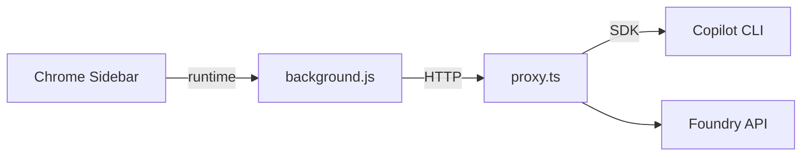

# IQ Copilot Browser Extension

> Chrome Extension (MV3) + Local Proxy，企業級 AI 助手側欄。

[](https://github.com/user/repo/actions)

## Quick Start

```bash
# 1. 安裝依賴
npm install

# 2. 啟動服務
./start.sh

# 3. 載入擴充功能
# chrome://extensions → 開發人員模式 → Load unpacked → 選擇本目錄
```

## Features

- 🗂️ **多 Tab 聊天** - 最多 10 個並行對話
- 🤖 **Per-Tab 模型** - 每個 Tab 可選用不同模型
- ⚡ **Quick Custom Prompt** - 儲存常用 prompt，一鍵套用
- 📎 **檔案問答** - 上傳附件後直接分析與回答
- 🌐 **網頁問答** - 讀取當前頁面內容後回答
- 🔧 **Skills/Tools** - 視覺化工具執行狀態
- 📡 **Proactive Scan** - 頁面智慧掃描建議
- 📊 **Token Tracking** - 即時用量追蹤
- 🏆 **Achievement System** - 遊戲化互動

## Architecture



## Documentation

📚 **[Full Documentation →](./docs/README.md)**

- [Features](./docs/FEATURES.md)
- [Demo Script](./docs/DEMO.md)
- [Architecture](./docs/architecture.md)
- [CI/CD Flow](./doc/cicd_flow.md)
- [RAI Notes](./docs/README.md#-responsible-ai-rai-notes)

## Project Structure

```
├── src/               # 源代碼
│   ├── sidebar.*      # Extension UI
│   ├── background.js  # Service Worker
│   ├── proxy.ts       # Local API gateway
│   ├── lib/           # 共用模組
│   │   └── panels/    # UI 面板模組
│   ├── routes/        # Proxy API 路由
│   └── scripts/       # Build scripts
├── docs/              # 完整文件
├── tests/             # 測試檔案
├── presentations/     # Demo 簡報
├── AGENTS.md          # Agent 開發指引
└── mcp.json           # MCP 設定
```

## Development

```bash
npm run lint          # Lint
npm test              # E2E tests
npm run build         # Build proxy
npm run build:watch   # Watch mode
```

## License

MIT
