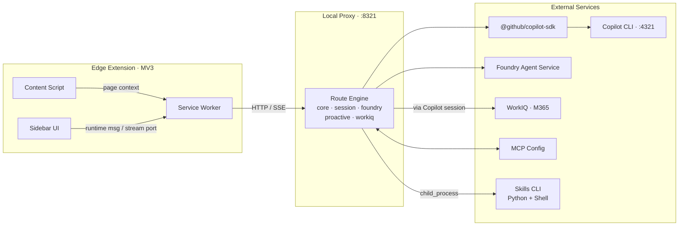
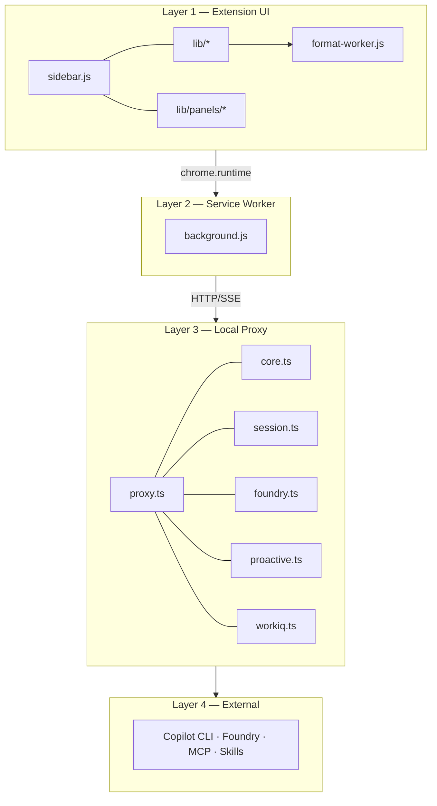
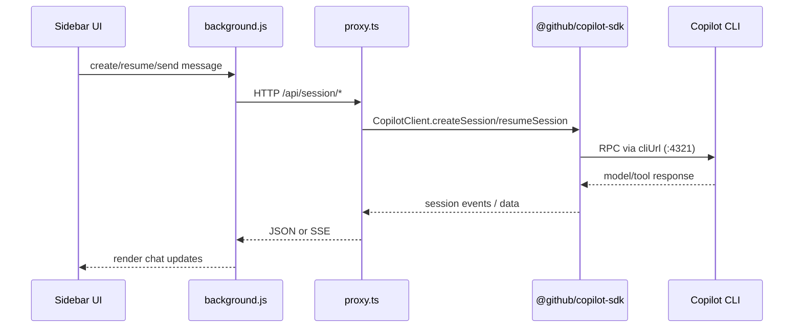
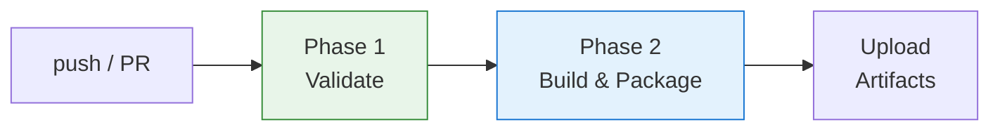

# IQ Copilot — Technical Guide

> Consolidated technical document (Architecture + CI/CD + E2E Testing)
> Last updated: 2026-03-01

---

## 1) System Overview

IQ Copilot is an Edge MV3 sidebar extension that bridges local and enterprise AI services through a localhost proxy.

### Core integration map



- **Extension UI** (`sidebar.js`, `lib/*`, `lib/panels/*`)
- **MV3 Service Worker** (`background.js`)
- **Local Proxy** (`proxy.ts`, routes in `src/routes/*`, default `127.0.0.1:8321`)
- **External backends**:
  - GitHub Copilot CLI (`:4321`) via `@github/copilot-sdk`
  - Microsoft Foundry Agent Service
  - WorkIQ (M365)
  - MCP config and local skills

### Design principles

- Layered separation: UI / background / proxy / integrations
- Domain-based routes: `core`, `session`, `foundry`, `proactive`, `workiq`
- Event-driven streaming: SSE from proxy to background to sidebar
- Security boundaries: validation, body limits, secret redaction

---

## 2) Runtime Architecture



## 2.1 Layer 1 — Extension UI

Primary responsibilities:

- Chat UX, panel rendering, slash commands, multi-tab session UX
- Theme/i18n/state handling
- Attachment processing and formatting worker usage

Key modules:

- `src/sidebar.js`
- `src/lib/chat.js`, `chat-streaming.js`, `chat-session.js`, `chat-tabs.js`
- `src/lib/command-menu.js`, `state.js`, `utils.js`, `i18n.js`, `theme.js`
- `src/lib/panels/*`

## 2.2 Layer 2 — Service Worker (MV3)

Responsibilities:

- Message routing for UI actions and command execution
- SSE bridge via `chrome.runtime.onConnect` stream ports
- Storage coordination (`chrome.storage.local` / `chrome.storage.session`)
- Alarm-triggered background workflows (health checks, proactive scans)

## 2.3 Layer 3 — Local Proxy

Responsibilities:

- HTTP endpoint serving and route registration
- Session lifecycle (`Map<string, CopilotSession>`)
- Foundry / WorkIQ / proactive orchestration
- Local skill execution via `child_process.execFile`
- MCP config read/write support

## 2.4 Layer 4 — External Integrations

- Copilot CLI through SDK sessions
- Foundry Agent Service for enterprise semantic agents
- WorkIQ tools through Copilot session
- Local and external MCP tools

---

## 3) Route Domains and Contracts

The proxy registers routes by domain and dependency interface, enabling targeted unit tests and safer refactoring.

### Route groups

- **Core**: health/model/tool/context/mcp/skills endpoints
- **Session**: create/resume/list/delete/send/sendAndWait/switch-model
- **Foundry**: config/status/chat
- **Proactive**: config and scan endpoints
- **WorkIQ**: query endpoint

### Validation and contracts

- Shared contracts in `src/shared/types.ts`
- Input schemas in `src/routes/schemas.ts` (Zod)
- Body parsing guard in `src/lib/proxy-body.ts`

### Copilot SDK usage map

The project actively uses `@github/copilot-sdk` in runtime code (not only as a dependency).

Key integration points:

- `package.json` includes `@github/copilot-sdk` in `dependencies`.
- `src/proxy.ts` imports `CopilotClient`, `approveAll`, and `CopilotSession` types.
- `src/proxy.ts` creates `new CopilotClient({ cliUrl })` and keeps a shared client instance.
- `src/routes/session.ts` calls `createSession` and `resumeSession` for chat lifecycle.
- `src/routes/workiq.ts` uses `CopilotSession` types for WorkIQ route handling.
- `src/shared/types.ts` defines route dependency contracts with `CopilotClient`/`CopilotSession`.

Request path (runtime):



---

## 4) Skills and Agent Execution

The extension supports local skills under `.github/skills/`.

### Current skills

- `foundry_agent_skill` (Foundry agent invocation)
- `gen-img` (image generation)

### Execution flow

1. UI triggers slash command.
2. Background sends execution request to proxy.
3. Proxy executes skill wrapper with `execFile`.
4. Script calls target backend (for example, Foundry).
5. Result returns to UI as a chat response.

Security note: `execFile` (non-shell) is used to reduce injection risk.

---

## 5) Local Development Setup

### Required environment (BYOE)

- Node.js 20+
- Edge (MV3 compatible)
- GitHub Copilot CLI and `copilot auth login`
- Azure CLI and `az login` (for Foundry-related skills)

### Optional but recommended

- `npx playwright install chromium` for E2E
- `.env` from `.env.example`
- `.github/skills/foundry_agent_skill/.env` from `.env.example`

### Startup

```bash
npm install
./start.sh
curl http://127.0.0.1:8321/api/ping
```

`./start.sh` starts Copilot CLI and local proxy together.

---

## 6) How to Run and Use the Extension

1. Open `edge://extensions`
2. Enable Developer mode
3. Click **Load unpacked** and choose the repo root
4. Open any page and launch side panel
5. Use chat or slash commands (`/help`, `/workiq`, `/foundry_agent_skills`, `/model`)

---

## 7) Testing Strategy

## 7.1 Unit Tests (Vitest)

```bash
npm run test:unit
```

Typical scope includes:

- route behavior
- schema guards
- streaming and utility logic

## 7.2 E2E Tests (Playwright)

```bash
# prerequisite: keep proxy running
./start.sh

# run all tests
npx playwright test

# single file
npx playwright test tests/demo-chat.spec.js
```

### Useful flags

```bash
npx playwright test --workers=1 --timeout=180000 --reporter=list
```

### Common suites

- `tests/extension.spec.js` (extension basics)
- `tests/demo-chat.spec.js` (chat and slash commands)
- `tests/demo-multitab.spec.js` (independent tab sessions)
- `tests/demo-panels.spec.js` (panel behavior)
- `tests/demo-skills.spec.js` (skills/MCP)
- `tests/demo-agents.spec.js` (Foundry agents and image generation)

### Typical troubleshooting

- `ERR_CONNECTION_REFUSED`: verify `./start.sh`, and ping `127.0.0.1:8321`
- stream timeout: increase timeout and reduce workers
- extension load issues: verify `manifest.json` and Chromium installation

---

## 8) CI/CD Flow

The workflow is defined in `.github/workflows/ci.yml`.



### Trigger conditions

- Push to `main`
- Pull request to `main`

### Phase 1 — Validate (quality + security)

Quality checks:

- `npm run lint`
- `npm run typecheck`
- `npm run test:unit`
- `npm test` (Playwright E2E)

Security checks:

- hardcoded secret patterns
- `.gitignore` guard for secret file patterns
- `manifest.json` guardrails (for example CSP checks)
- inline script checks in HTML (MV3 compliance)

### Phase 2 — Build & Package (gated)

Runs only when Validate passes.

- Sync version from `package.json` to `manifest.json`
- Build artifacts (`npm run build`)
- Package extension zip and companion zip
- Upload artifacts via GitHub Actions

---

## 9) Security Model

- Localhost-only proxy boundary
- Input validation with Zod
- Request body size limits
- Secret redaction in logs
- Least-privilege extension permissions
- Explicit transparency for tool execution and token usage

---

## 10) Operations Checklist

Before local testing:

- `copilot auth login` is valid
- `az login` is valid
- Foundry endpoint/auth config is prepared
- required agents (UM/PKM/Fabric) are available
- proxy health endpoint responds

Before merge to `main`:

- lint/typecheck/unit/e2e are green
- no secret leakage in tracked files
- packaging output is generated as expected
