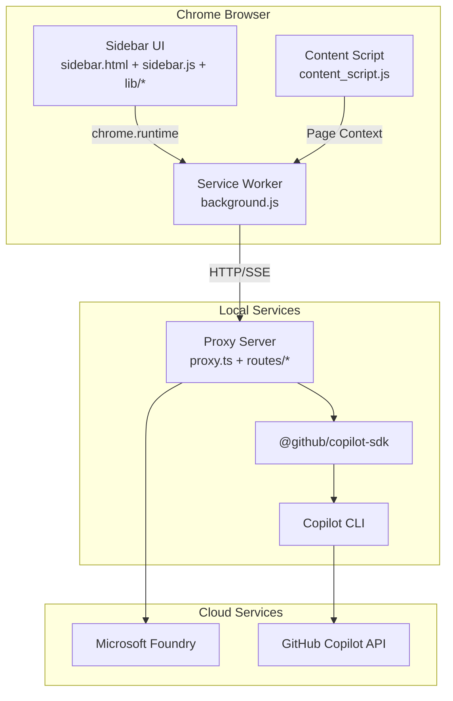

# IQ Copilot Browser Extension

> Chrome Extension (MV3) + Local Proxy，提供企業級 AI 助手側欄、多 Tab 聊天、Skills/Tools 整合與 Proactive 智慧掃描。

## 🎯 Problem → Solution

### 問題

企業用戶在瀏覽器中工作時，需要頻繁切換到其他 AI 工具視窗，打斷工作流程。現有解決方案缺乏：
- 與企業內部工具（Work IQ、Foundry）的整合
- 多對話並行處理能力
- 上下文感知的主動式建議
- 統一的 token 用量追蹤

### 解決方案

IQ Copilot 提供**瀏覽器原生側欄 AI 助手**，支援：
- ✅ **多 Tab 並行聊天** - 最多 10 個獨立對話，各自保留歷史
- ✅ **Per-Tab 模型選擇** - 每個 Tab 可選用不同 AI 模型
- ✅ **Skills/Tools 整合** - 視覺化工具執行狀態與結果
- ✅ **Proactive Scan** - 主動掃描頁面提供智慧建議
- ✅ **Token Usage Tracking** - 即時追蹤 API 呼叫與 token 消耗
- ✅ **Achievement System** - 遊戲化互動提升使用者黏著度

---

## 📋 Prerequisites

- **Node.js** 18+ 
- **Chrome** 90+ (MV3 support)
- **Copilot CLI** 已安裝並完成 GitHub 認證
- **Work IQ 帳號** (企業身份驗證)

### Copilot CLI 安裝

```bash
# 依照 Copilot CLI 官方文件安裝
# 完成後執行登入
copilot auth login
```

---

## 🚀 Setup & Installation

### 1. 安裝依賴

```bash
npm install
```

### 2. 環境設定

```bash
cp .env.example .env
# 編輯 .env 設定 PROXY_PORT 等參數
```

### 3. 啟動服務

```bash
./start.sh
```

這會同時啟動：
- Copilot CLI server mode
- Local Proxy (預設 port 8321)

### 4. 載入 Chrome 擴充功能

1. 開啟 `chrome://extensions`
2. 啟用「開發人員模式」
3. 點選「Load unpacked」
4. 選擇本專案根目錄

---

## 📦 Deployment

### 開發環境

```bash
# 啟動開發模式（含 watch）
npm run build:watch &
./start.sh
```

### 生產環境

```bash
# 建置最佳化 bundle
npm run build

# 打包擴充功能
zip -r iq-copilot-extension.zip \
  manifest.json background.js content_script.js \
  sidebar.* copilot-rpc.js \
  lib/ icons/ dist/
```

### CI/CD

參見 `.github/workflows/ci.yml`：
- Lint 檢查
- 單元測試
- E2E 測試
- 自動打包

---

## 🏗️ Architecture



### 元件說明

| 元件 | 檔案 | 職責 |
|------|------|------|
| **Sidebar UI** | `sidebar.*`, `lib/*` | 使用者介面、聊天、面板管理 |
| **Service Worker** | `background.js` | 訊息路由、串流橋接 |
| **Content Script** | `content_script.js` | 頁面上下文擷取 |
| **Proxy Server** | `proxy.ts`, `routes/*` | API 閘道、認證、SSE 串流 |
| **Copilot SDK** | `@github/copilot-sdk` | CLI 通訊協定 |

詳細架構說明：[architecture.md](./architecture.md)

---

## 🛡️ Responsible AI (RAI) Notes

### 資料處理

- ✅ **本地優先** - 所有對話處理在使用者本機進行
- ✅ **無伺服器儲存** - 對話歷史僅存於 Chrome local storage
- ✅ **最小權限** - 僅請求必要的瀏覽器權限

### 隱私保護

- 頁面內容擷取需使用者明確觸發 (Proactive Scan)
- 不自動收集或傳送瀏覽歷史
- Token 用量統計僅保存於本地

### 透明度

- 所有工具執行狀態即時顯示
- API 呼叫次數與 token 消耗可追蹤
- 模型選擇與能力限制清楚標示

### 安全考量

- CORS 限制僅允許擴充功能來源
- 無外部追蹤腳本
- 認證 token 不持久化於客戶端

### 限制聲明

- AI 回應可能不準確，使用者應驗證重要資訊
- 不應用於處理機密或敏感個人資料
- 企業環境應配合組織 AI 使用政策

---

## 📚 Additional Documentation

- [Features Overview](./FEATURES.md) - 功能詳細說明與使用方式
- [Architecture Deep Dive](./architecture.md) - 系統架構深入解析
- [Challenge Analysis](./challenge-analysis.md) - Hackathon 提交分析與改進計畫

---

## 🧪 Testing

```bash
# 單元測試
npm run test:unit

# E2E 測試
npm test

# 測試覆蓋率
npm run test:coverage
```

測試說明：[tests/README.md](../tests/README.md)

---

## 📄 License

MIT
