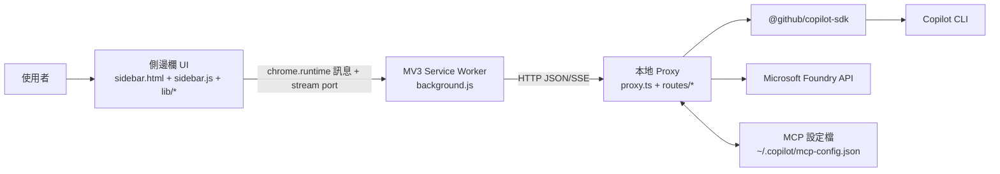

# IQ Copilot 架構文件

> 最後更新：2026-02-27
> 範圍：瀏覽器擴充功能（MV3）+ 本地 Proxy + Copilot CLI 整合

## 1) 系統總覽

IQ Copilot 是一個 **Chrome 側邊欄擴充功能**，會先呼叫本地 HTTP Proxy，再由 Proxy 透過 `@github/copilot-sdk` 橋接到 Copilot CLI。

---

## 2) 執行時分層

### A. 擴充功能 UI 層
- 入口 HTML/CSS/Bootstrap：
  - `sidebar.html`
  - `sidebar.css`
  - `sidebar.js`
- 功能模組由 `lib/*` 與 `lib/panels/*` 載入。
- UI 主要職責：
  - 面板導覽（`chat`、`context`、`history`、`usage`、`mcp`、`notifications`、`achievements`、`config`、`version`）
  - 聊天輸入與檔案上傳體驗
  - tool 視覺化
  - Foundry / MCP 設定體驗

### B. 擴充功能背景層（MV3 Service Worker）
- 檔案：`background.js`
- 主要職責：
  - 接收並路由 sidebar 訊息（`CHECK_CONNECTION`、`CREATE_SESSION`、`LIST_MODELS`、`PROACTIVE_*`、`SET_FOUNDRY_CONFIG` 等）
  - 透過 `chrome.runtime.onConnect`（`copilot-stream`）維持長連線串流橋接
  - 連線狀態廣播具備 **change gate**（避免重複重連造成風暴）
  - 以 alarm 排程健康檢查與 proactive 掃描

### C. 本地 Proxy 層
- 入口：`proxy.ts`
- 路由模組：
  - `routes/core.ts`
  - `routes/session.ts`
  - `routes/foundry.ts`
  - `routes/proactive.ts`
- 主要職責：
  - 提供背景層呼叫的 HTTP API
  - 將 HTTP payload 轉為 Copilot SDK 呼叫
  - 維護記憶體內 session map
  - 管理上傳暫存檔與清理
  - 讀寫 MCP 設定檔

### D. 外部整合層
- 透過 `@github/copilot-sdk` 整合 Copilot CLI
- Microsoft Foundry 端點
- 本機檔案系統（MCP 設定）

---

## 3) 前端模組架構

### 3.1 啟動協調（Bootstrap Orchestration）
- `sidebar.js` 為精簡協調器：
  - 初始化模組別名（`IQ.state`、`IQ.chat`、`IQ.connection`、`IQ.panels.*`）
  - 綁定頂層 UI 事件
  - 將業務邏輯委派給 `lib/*`

### 3.2 核心用戶端模組（`lib/*`）
- `lib/state.js`：常數、設定與共享狀態原語
- `lib/i18n.js`：在地化字典與執行時訊息在地化
- `lib/theme.js`：主題與語言偏好
- `lib/utils.js`：工具函式（背景訊息、快取、格式化、除錯）
- `lib/connection.js`：連線生命週期，區分冷啟動完整初始化與輕量同步
- `lib/chat.js` / `lib/chat-streaming.js` / `lib/chat-session.js`：
  - session 管理
  - 串流事件渲染
  - tool UI 狀態
- `lib/file-upload.js`：附件管理

### 3.3 面板模組（`lib/panels/*`）
- `context.js`、`history.js`、`usage.js`、`mcp.js`、`achievements.js`
- Proactive 拆分為專責模組：
  - `proactive-state.js`（狀態與通知已讀/未讀模型）
  - `proactive-render.js`（UI 渲染與動作）
  - `proactive-scan.js`（掃描執行與更新處理）
  - `proactive.js`（組合 façade）

---

## 4) 後端路由架構

### 4.1 路由註冊
在 `proxy.ts` 中，各路由領域透過明確的相依注入註冊：
- `registerCoreRoutes`
- `registerSessionRoutes`
- `registerFoundryRoutes`
- `registerProactiveRoutes`

此設計讓路由邏輯更易隔離與測試。

### 4.2 路由領域

#### Core（`routes/core.ts`）
- 健康檢查（`GET /health`）
- ping / models / tools / quota / context
- MCP 設定讀寫
- 聚合 context 快照（status/auth/models/tools/sessions/quota/foundry）

#### Session（`routes/session.ts`）
- Session 建立 / 恢復 / 列表 / 刪除 / 銷毀 / 訊息
- Send and wait（`/api/session/sendAndWait`）
- 串流 SSE（`/api/session/send`）
- 每個 session 可切換模型

#### Foundry（`routes/foundry.ts`）
- Foundry 設定端點
- Foundry 聊天代理端點
- Foundry 狀態端點

#### Proactive（`routes/proactive.ts`）
- Proactive 設定讀寫
- 單項掃描（`briefing`、`deadlines`、`ghosts`、`meeting-prep`）
- 平行 scan-all（含節流與來源標記）

---

## 5) 資料流（關鍵情境）

### 5.1 聊天串流流程
1. 使用者從側邊欄送出訊息。
2. `sidebar.js` 委派到 `chat.sendMessageStreaming`。
3. UI 開啟到背景層的 `copilot-stream` port。
4. 背景層轉發至 Proxy 的 `/api/session/send`。
5. Proxy 訂閱 session 事件並輸出 SSE。
6. 背景層轉譯為 `STREAM_EVENT` / `STREAM_DONE` / `STREAM_ERROR`。
7. Chat 模組更新：
   - assistant delta
   - tool 卡片（狀態 + 計時 + 摘要）
   - intent bar

### 5.2 連線初始化流程
1. Sidebar 冷啟動觸發 `checkConnection("cold-start")`。
2. 背景層解析狀態並僅在變更時廣播。
3. `lib/connection.js` 依來源執行：
   - 冷啟動：完整初始化
   - 重連 / alarm / 手動：輕量同步
4. Context / models / tools / sessions / quota 分發到各面板。

### 5.3 Proactive 掃描流程
1. 由 sidebar（手動）或 alarm（背景）觸發掃描。
2. 背景層呼叫 Proxy proactive 端點。
3. Proxy 以節流 + 平行子呼叫執行 scan-all。
4. Sidebar 接收更新並分區塊渲染。
5. 重新計算通知 badge 與已讀狀態。

### 5.4 Foundry 設定流程
1. UI 儲存 endpoint / auth method。
2. 背景層儲存：
   - endpoint / auth method 至 `chrome.storage.local`
   - api key（legacy 模式）至 `chrome.storage.session`
3. 背景層嘗試同步 Proxy 設定。
4. 測試按鈕呼叫 Proxy Foundry 測試端點。

---

## 6) 狀態與持久化模型

### 瀏覽器儲存
- `chrome.storage.local`
  - CLI host/port
  - foundry endpoint/auth method
  - proactive prompt
  - UI 偏好
  - system message
- `chrome.storage.session`
  - 敏感執行期資料（例如 apikey 模式的 Foundry API key）

### 記憶體內狀態
- Proxy：`sessions: Map<string, CopilotSession>`
- Chat 模組：session/model/history/tool 執行期狀態
- Connection 模組：debounce、初始化標記與執行期 gate

### 檔案系統狀態
- 使用者目錄下 MCP 設定檔讀寫
- 上傳暫存檔（TTL/大小/數量）清理策略

---

## 7) 契約與型別

- 共用介面與路由相依契約集中於 `shared/types.ts`。
- 請求驗證 schema 位於 `routes/schemas.ts`。
- Proxy body parsing 與保護邏輯拆分於 `lib/proxy-body.ts`。

---

## 8) 可靠性與效能設計

- 連線狀態廣播 gate 可避免面板重複刷新風暴。
- Proactive scan-all 具備節流防護與明確來源 metadata。
- Proactive 平行掃描可降低整體等待時間。
- 上傳暫存檔生命週期控制可限制磁碟使用量。

---

## 9) 安全邊界

- 擴充功能僅具 localhost host 權限（`manifest.json`）。
- Proxy 日誌對敏感資訊採遮罩/隱碼（`proxy.ts`）。
- 敏感金鑰優先存放於 session scope。
- Request body 大小限制與 schema 驗證可降低畸形/超大 payload 風險。

---

## 10) 測試架構

- 單元測試（Vitest）：
  - 路由行為（`routes.test.ts`、`foundry-routes.test.ts`）
  - SSE 行為（`session-sse.test.ts`）
  - body parser 防護（`proxy-body.test.ts`）
  - 成就邏輯（`achievement-engine.test.ts`）
- E2E 測試（Playwright）：
  - 擴充功能互動情境（`tests/extension.spec.js`）

---

## 11) 建置與執行

- `npm run build`：建置 proxy bundle
- `npm run test:unit`：執行單元測試
- `./start.sh`：啟動 proxy + 本地健康檢查流程

---

## 12) 目前架構方向

1. 持續維持 `lib/*` 與 `lib/panels/*` 的 UI 模組化。
2. 持續維持 Proxy 路由領域隔離與相依注入。
3. 優先採用聚合 context 讀取 + 輕量重連同步。
4. 持續強化事件驅動 UX（tool）與 proactive 工作流。
