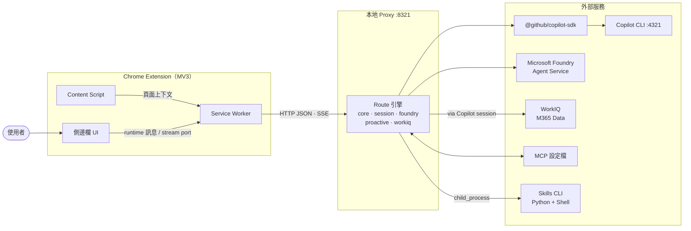
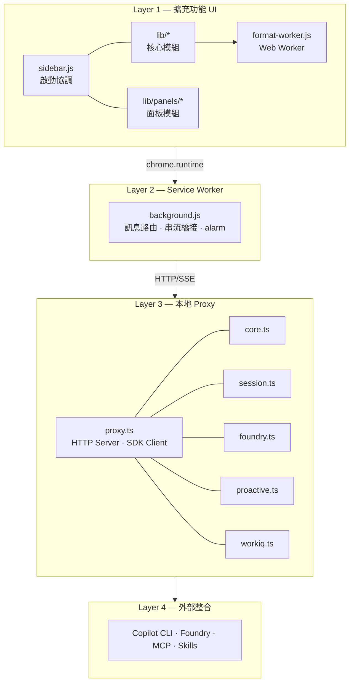
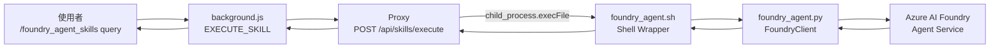
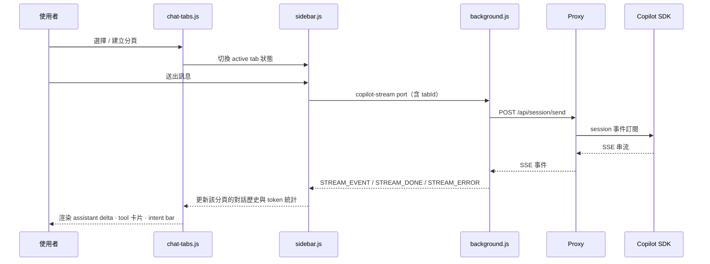
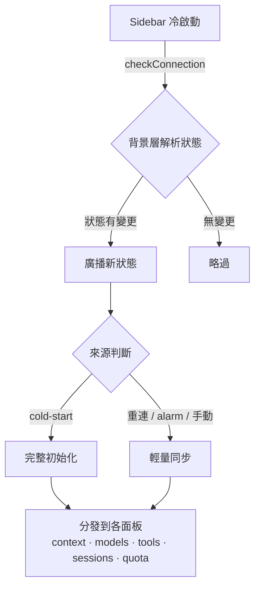
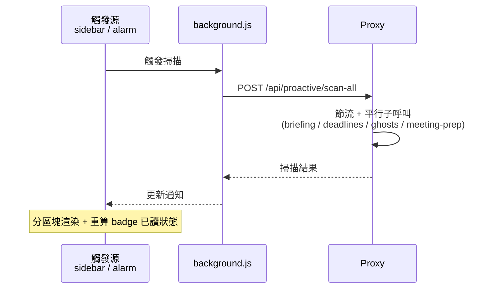
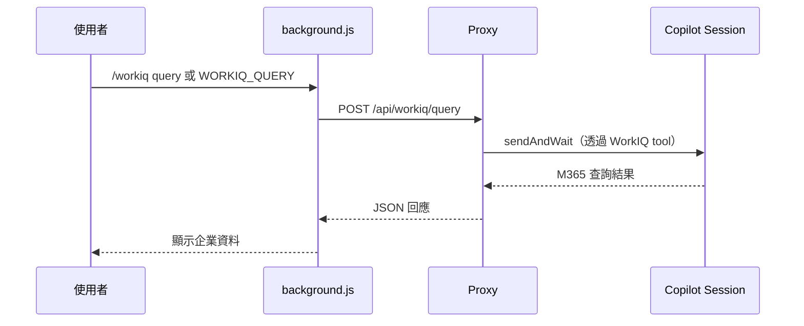
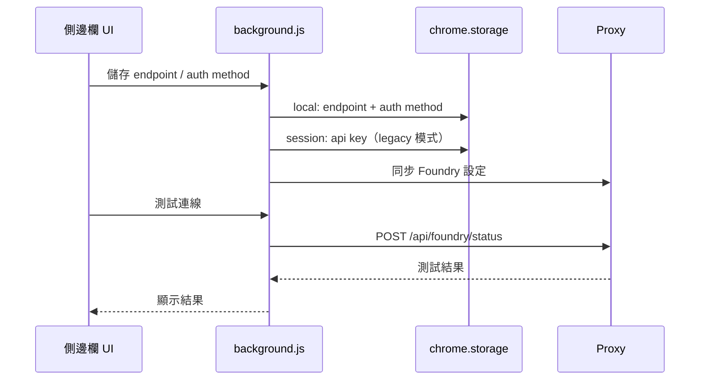
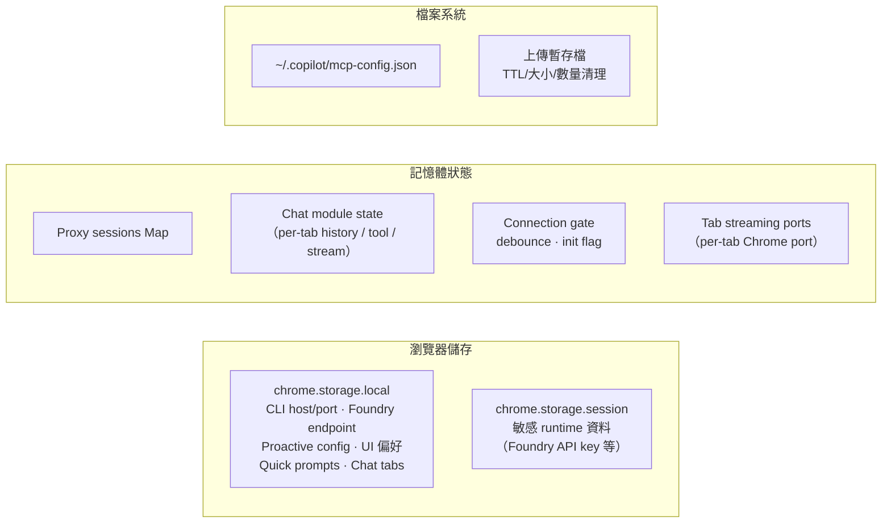

# IQ Copilot 架構文件

> 最後更新：2026-03-01
> 範圍：瀏覽器擴充功能（MV3）+ 本地 Proxy + Copilot CLI + Foundry + WorkIQ 整合

---

## 1) 系統總覽

IQ Copilot 是一個 **Chrome 側邊欄 AI 助手**，透過本地 HTTP Proxy 橋接 GitHub Copilot CLI、Microsoft Foundry Agent Service 與企業 WorkIQ（M365 資料查詢），提供多分頁聊天、技能執行、Smart Notifications 與 MCP 工具整合等能力。



### 設計原則

| 原則 | 說明 |
|------|------|
| **分層隔離** | UI · 背景 · Proxy · 外部整合各層職責清晰，介面最小化 |
| **路由領域化** | 五大路由模組透過相依注入註冊，可獨立測試與替換 |
| **事件驅動串流** | 聊天採 SSE 單向推送，Proxy→背景層→UI 逐層轉譯 |
| **安全邊界前置** | Zod schema 驗證、body 大小限制、敏感值遮罩綜合防護 |

---

## 2) 執行時分層



### Layer 1 — 擴充功能 UI

| 元件 | 職責 |
|------|------|
| `sidebar.js` | 啟動協調器：初始化 `IQ.*` 命名空間、綁定頂層事件、委派至 lib |
| `lib/state.js` | 全域常數、設定與共享狀態原語 |
| `lib/i18n.js` | 在地化字典與執行時訊息翻譯 |
| `lib/theme.js` | 深淺主題與語言偏好切換 |
| `lib/utils.js` | 背景訊息封裝、快取、格式化、除錯日誌 |
| `lib/connection.js` | 連線生命週期：冷啟動完整初始化 vs. 輕量重連同步 |
| `lib/chat.js` · `chat-streaming.js` · `chat-session.js` | Session 管理、SSE 串流事件渲染、tool UI 狀態 |
| `lib/chat-tabs.js` | **多分頁聊天**：最多 10 個獨立 session，每頁可選模型與技能 |
| `lib/command-menu.js` | **斜線命令面板**：`/help`、`/foundry_agent_skills`、`/workiq`、`/model`、`/mcp` |
| `lib/file-upload.js` | 附件管理（圖片/文字/PDF） |
| `lib/format-worker.js` | **Web Worker**：Markdown → HTML 離主執行緒轉換，避免長文本造成 UI 卡頓 |

面板模組（`lib/panels/*`）：

| 模組 | 用途 |
|------|------|
| `context.js` | 聚合系統上下文快照（連線/模型/工具/session/quota/foundry） |
| `history.js` | 聊天歷史管理 |
| `usage.js` | Token 用量與成本追蹤面板 |
| `mcp.js` | MCP 伺服器設定 UI |
| `achievements.js` | 成就引擎互動面板 |
| `quick-prompts.js` | **常用提示詞範本**：使用者自訂快速填入 |
| `helpers.js` | 面板共用 UI 元件（按鈕/HTML escape/屬性渲染） |
| Proactive 系列 | `proactive-state.js`（通知讀取模型）· `proactive-render.js`（UI）· `proactive-scan.js`（掃描）· `proactive.js`（façade） |

### Layer 2 — Service Worker（MV3 背景層）

- 訊息路由中樞：處理 30+ 訊息類型（`CREATE_SESSION`、`SWITCH_MODEL`、`EXECUTE_SKILL`、`WORKIQ_QUERY`、`PROACTIVE_*`、`SET_FOUNDRY_CONFIG` 等）
- `chrome.runtime.onConnect`（`copilot-stream`）串流橋接：背景層持有 HTTP SSE 長連線，再經 port 轉推至 UI
- 連線狀態廣播具備 **change gate**（值未變不發送，避免重複重連風暴）
- `chrome.alarms` 排程：週期性健康檢查與 proactive 掃描
- 透過 `chrome.storage` 存取設定（`local` 持久層 + `session` 敏感資料層）

### Layer 3 — 本地 Proxy

- 進入點 `proxy.ts`（Node.js HTTP Server，port 8321）
- 建立 `CopilotClient`（指向 Copilot CLI port 4321），管理 `sessions: Map<string, CopilotSession>`
- 五大路由模組透過相依注入（`*RouteDeps` 介面）註冊
- 上傳暫存檔 TTL/大小/數量清理策略
- 敏感日誌值遮罩（secret redaction）

### Layer 4 — 外部整合

| 整合目標 | 方式 |
|----------|------|
| GitHub Copilot CLI | `@github/copilot-sdk`（`CopilotClient` → `CopilotSession`） |
| Microsoft Foundry Agent Service | HTTP REST（endpoint/key 由使用者設定） |
| WorkIQ（M365） | 透過 Copilot session 中的 WorkIQ tool 查詢 |
| MCP 設定 | 讀寫 `~/.copilot/mcp-config.json` |
| Skills CLI | `child_process.execFile` 呼叫 shell/python 腳本 |

---

## 3) 後端路由架構

### 3.1 路由註冊模式

```
proxy.ts
  ├─ registerCoreRoutes(deps: CoreRouteDeps)
  ├─ registerSessionRoutes(deps: SessionRouteDeps)
  ├─ registerFoundryRoutes(deps: FoundryRouteDeps)
  ├─ registerProactiveRoutes(deps: ProactiveRouteDeps)
  └─ registerWorkiqRoutes(deps: WorkiqRouteDeps)
```

每個 `*RouteDeps` 介面定義該領域所需的外部依賴（sessions map、copilotClient、foundryState、execFile 等），使路由邏輯可在測試中以 mock 替換。

### 3.2 路由領域概覽

| 領域 | 主要端點 | 職責 |
|------|----------|------|
| **Core** | `GET /health`、`POST /api/ping`、`/api/models`、`/api/tools`、`/api/skills/local`、`/api/skills/execute`、`/api/quota`、`/api/context`、`GET\|POST /api/mcp/config` | 系統健康、模型/工具列舉、技能執行（live）、聚合上下文快照、MCP 設定讀寫 |
| **Session** | `POST /api/session/{create,resume,list,delete,destroy,messages,sendAndWait,send,switch-model}` | Session CRUD、模型切換、同步呼叫、SSE 串流 |
| **Foundry** | `POST /api/foundry/{config,chat,status}` | Foundry Agent 設定、聊天、連線狀態 |
| **Proactive** | `GET\|POST /api/proactive/config`、`POST /api/proactive/{briefing,deadlines,ghosts,meeting-prep,scan-all}` | Smart Notifications：設定讀寫、個別掃描、平行 scan-all |
| **WorkIQ** | `POST /api/workiq/query` | M365 資料查詢：將 user query 透過 Copilot session 中的 WorkIQ tool 取得企業 M365 資訊 |

### 3.3 契約與驗證

- **型別契約**：`shared/types.ts` 集中定義所有路由相依介面（`CoreRouteDeps`、`SessionRouteDeps` 等）、`RouteTable`、`Attachment`、`FoundryState`、`ProactiveConfig`
- **輸入驗證**：`routes/schemas.ts` 以 Zod 定義各 endpoint schema（`switchModel`、`sessionCreate`、`skillsExecute`、`foundryConfig`、`proactiveConfig`、`workiqQuery` 等）
- **Body parsing**：`lib/proxy-body.ts` 處理 JSON 解析與大小限制防護

---

## 4) 技能系統（Skills）

IQ Copilot 具備可擴充的技能執行框架，讓 AI 助手能呼叫本機腳本完成專門任務。



### 已註冊技能

| 技能 | 位置 | 說明 |
|------|------|------|
| `foundry_agent_skill` | `.github/skills/foundry_agent_skill/` | 透過 Azure AI Foundry Agent Service 呼叫企業 Agent（設備報修、IT 查詢等） |
| `gen-img` | `.github/skills/gen-img/` | 透過 Azure OpenAI DALL-E 生成圖片 |

### 執行機制
- **探索**：`/api/skills/local` 掃描 `.github/skills/` 目錄，解析各技能的 `SKILL.md` 取得描述
- **執行**：`/api/skills/execute` 以 `child_process.execFile` 啟動 shell wrapper，傳入環境變數（endpoint/key/agent name/query），stdout 回傳結果
- **前端整合**：`/foundry_agent_skills <query>` 斜線命令 → `EXECUTE_SKILL` 背景訊息 → Proxy 執行

---

## 5) 資料流（關鍵情境）

### 5.1 多分頁聊天串流



### 5.2 連線初始化



### 5.3 Proactive 掃描



### 5.4 WorkIQ 查詢



### 5.5 Foundry 設定與連線測試



---

## 6) 狀態與持久化模型



| 層級 | 儲存位置 | 典型內容 |
|------|----------|----------|
| 持久 | `chrome.storage.local` | CLI host/port、Foundry endpoint/auth、Proactive prompt、UI 偏好、system message、常用提示詞、分頁狀態 |
| 半持久 | `chrome.storage.session` | 敏感 runtime 資料（Foundry API key） |
| 記憶體 | Proxy `sessions` Map | `CopilotSession` 實例池 |
| 記憶體 | UI 各模組 | 每分頁的對話歷史、tool 狀態、串流 port |
| 檔案系統 | `~/.copilot/mcp-config.json` | MCP 伺服器組態 |
| 檔案系統 | OS temp | 上傳暫存檔（TTL 過期自動清理） |

---

## 7) 可靠性與效能設計

| 機制 | 效果 |
|------|------|
| 連線狀態 change gate | 值未變不廣播，避免面板重複刷新風暴 |
| 冷啟動 vs. 輕量同步區分 | 重連時僅同步差異，降低不必要的 API 呼叫 |
| Proactive scan-all 節流 | 防重複觸發、平行子呼叫降低總等待時間 |
| Format Worker（Web Worker） | Markdown→HTML 離主執行緒，長文本不阻塞 UI |
| 上傳暫存檔 TTL/大小/數量清理 | 限制磁碟佔用量 |
| 多分頁 Max 10 上限 | 防止記憶體無限膨脹 |
| SSE 串流 + per-tab port | 各分頁獨立串流通道，互不干擾 |

---

## 8) 安全邊界

| 層面 | 措施 |
|------|------|
| 網路邊界 | `host_permissions` 僅限 `localhost` / `127.0.0.1`，無外部直連 |
| 輸入驗證 | 所有路由輸入經 Zod schema 驗證 + body 大小限制 |
| 敏感值保護 | Proxy 日誌 secret redaction；API key 存放於 `chrome.storage.session`（非 local） |
| 內容安全 | `manifest.json` CSP；面板 HTML escape（`helpers.js` + `format-worker.js`） |
| 擴充功能權限 | 最小權限原則：`activeTab`、`sidePanel`、`tabs`、`storage`、`alarms` |
| Skills 執行 | 以 `execFile`（非 shell）呼叫腳本，環境變數傳參，避免注入風險 |

---

## 9) 測試架構

| 層別 | 框架 | 涵蓋範圍 |
|------|------|----------|
| **單元測試** | Vitest | 8 檔案、57+ 測試案例 |
| **E2E 測試** | Playwright | 5 平行 spec 檔 + 共用 helper |

### 單元測試覆蓋

| 測試檔 | 驗證範圍 |
|--------|----------|
| `core-routes.test.ts` | 核心路由（health、models、tools、skills/local、skills/execute、quota、context、mcp/config），含 live skill 執行 |
| `foundry-routes.test.ts` | Foundry 路由（config、chat、status） |
| `session-sse.test.ts` | SSE 串流行為與事件格式 |
| `routes.test.ts` | 路由匹配、404、content negotiation |
| `proxy-body.test.ts` | Body parsing 防護（大小限制、畸形 JSON、邊界案例） |
| `achievement-engine.test.ts` | 成就規則引擎邏輯 |
| `background-capture.test.js` | 背景層截圖訊息處理 |
| `utils.test.js` | 工具函式（格式化、快取、escape） |

### E2E 測試

| Spec | 情境 |
|------|------|
| `demo-chat.spec.js` | 聊天、串流、tool 卡片 |
| `demo-multitab.spec.js` | 多分頁建立、切換、獨立 session |
| `demo-panels.spec.js` | 面板導覽、上下文、歷史 |
| `demo-skills.spec.js` | Foundry skill 執行端到端 |
| `demo-agents.spec.js` | Foundry agent 聊天端到端 |

---

## 10) 建置與 CI/CD

| 命令 | 說明 |
|------|------|
| `./start.sh` | 啟動 Proxy + 健康檢查 |
| `npm run build` | 建置 proxy bundle |
| `npm run test:unit` | 執行 Vitest 單元測試 |
| `npm test` | 全量測試 |
| `npm run lint` | ESLint 檢查 |

CI/CD 流程：**Validate** → **Build & Package** → **Upload Artifacts**（詳見 [cicd_flow.md](cicd_flow.md)）

---

## 11) Manifest 與權限模型

```
manifest.json（Manifest V3）
├── permissions: activeTab · sidePanel · tabs · storage · alarms
├── host_permissions: <all_urls> · localhost · 127.0.0.1
├── side_panel: sidebar.html
├── background: service_worker → background.js
├── content_scripts: content_script.js（document_idle）
└── icons: 16 · 48 · 128
```

- `activeTab`：取得當前分頁 URL/title 作為上下文
- `sidePanel`：側邊欄 API
- `tabs`：多分頁資訊查詢
- `storage`：持久化設定與敏感 session 資料
- `alarms`：週期性背景排程

---

## 12) 架構演進方向

1. **UI 模組化持續精煉**：維持 `lib/*` 與 `lib/panels/*` 的高內聚低耦合，新功能以獨立模組加入。
2. **路由領域擴展**：新整合來源（如更多 MCP 工具、外部 API）以新路由模組加入，不擴張現有模組。
3. **技能系統可擴充**：新增技能僅需在 `.github/skills/` 新增目錄與 `SKILL.md`，無需修改核心程式碼。
4. **事件驅動 UX 強化**：持續以串流 + tool 卡片 + Smart Notifications 提升互動體驗。
5. **多分頁 session 隔離**：各分頁獨立模型選擇、技能篩選與 token 統計。
