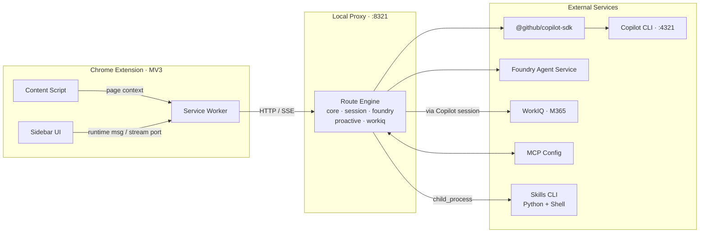
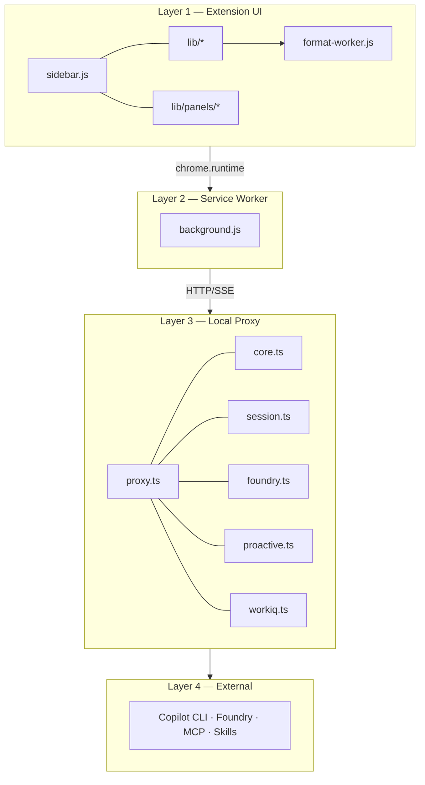
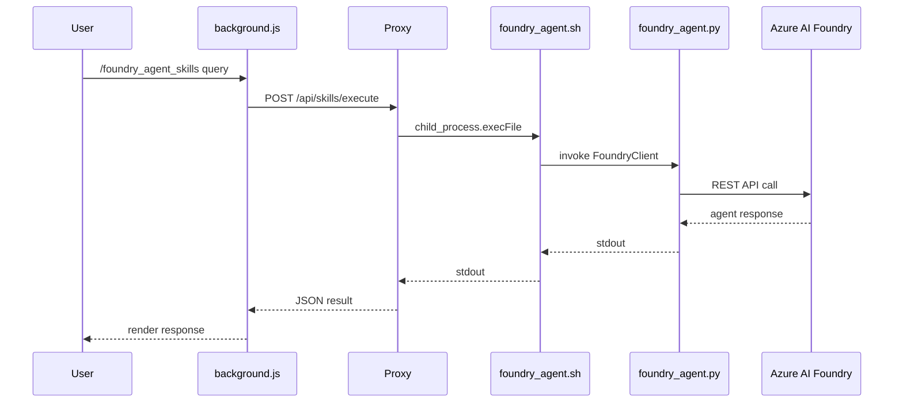
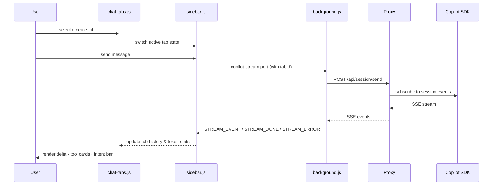
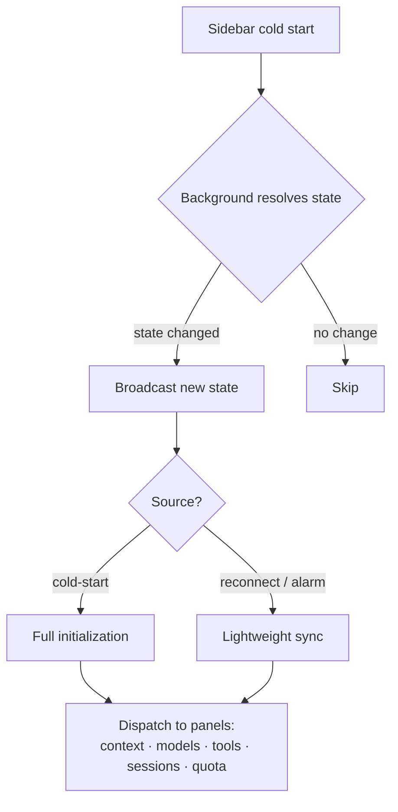
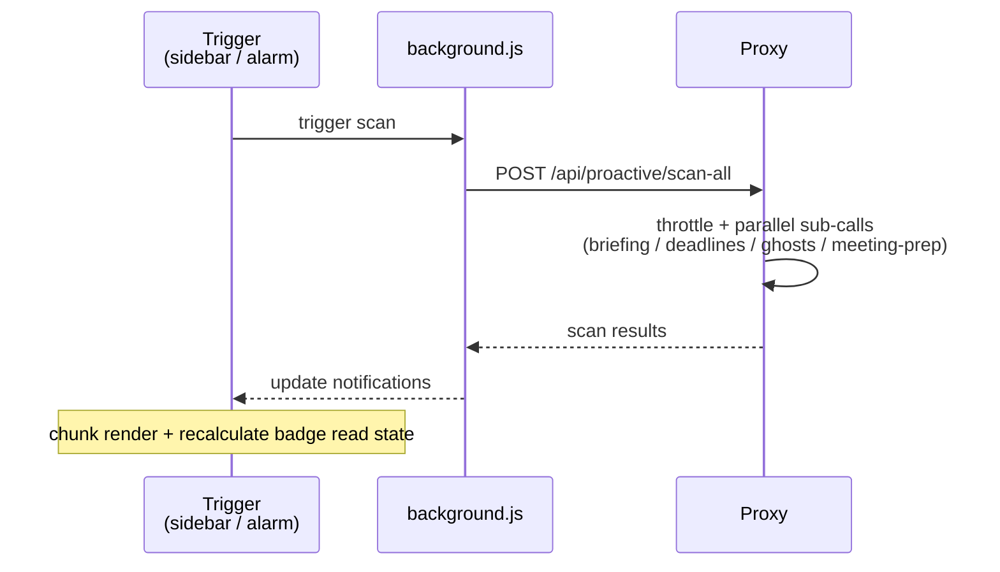
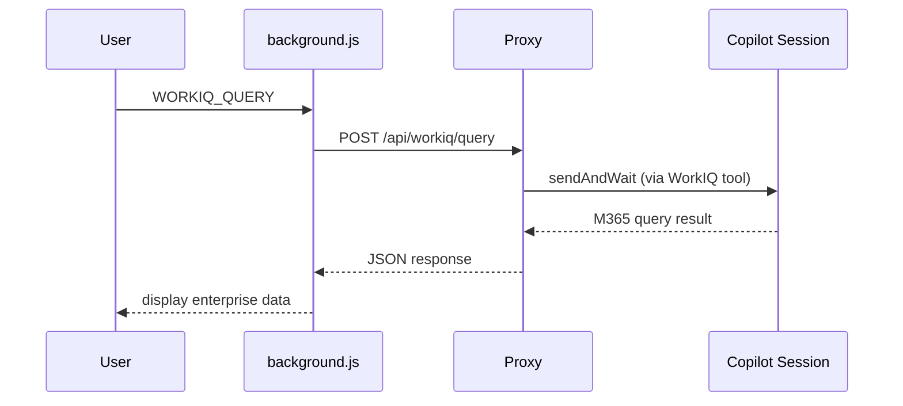
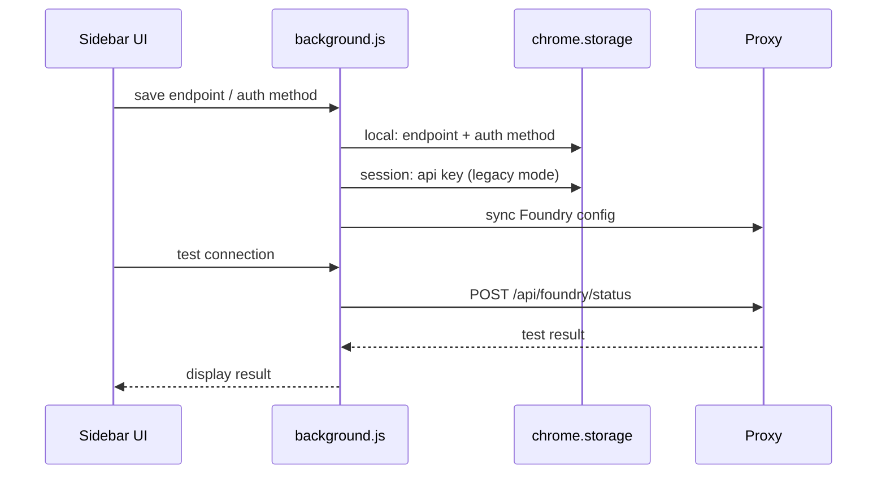
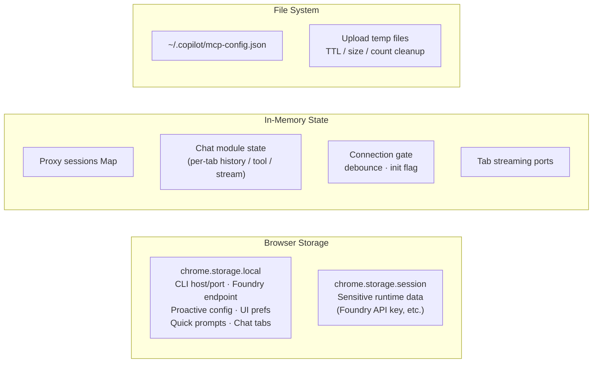

# IQ Copilot — Architecture

> Last updated: 2026-03-01

---

## 1. System Overview

IQ Copilot is a **Chrome sidebar AI assistant** (MV3) that bridges GitHub Copilot CLI, Microsoft Foundry Agent Service, and enterprise WorkIQ (M365) through a local HTTP proxy. It provides multi-tab chat, skill execution, Smart Notifications, and MCP tool integration.



### Design Principles

| Principle | Description |
|-----------|-------------|
| **Layered isolation** | UI, background, proxy, and external integrations each have clear responsibilities and minimal interfaces |
| **Domain-based routing** | Five route modules registered via dependency injection — independently testable and replaceable |
| **Event-driven streaming** | Chat uses SSE push: Proxy → Service Worker → UI, with per-layer translation |
| **Security-first boundaries** | Zod schema validation, body size limits, and secret redaction applied at ingress |

---

## 2. Runtime Layers



### Layer 1 — Extension UI

| Module | Responsibility |
|--------|----------------|
| `sidebar.js` | Boot coordinator: initializes `IQ.*` namespace, binds top-level events, delegates to lib |
| `lib/state.js` | Global constants, config, and shared state primitives |
| `lib/i18n.js` | Localization dictionary and runtime message translation |
| `lib/theme.js` | Light/dark theme and language preference toggle |
| `lib/utils.js` | Background messaging wrappers, caching, formatting, debug logging |
| `lib/connection.js` | Connection lifecycle: full cold-start init vs. lightweight reconnect sync |
| `lib/chat.js` · `chat-streaming.js` · `chat-session.js` | Session management, SSE stream event rendering, tool UI state |
| `lib/chat-tabs.js` | **Multi-tab chat**: up to 10 independent sessions, per-tab model & skill selection |
| `lib/command-menu.js` | **Slash command palette**: `/help`, `/foundry_agent_skills`, `/model list\|refresh\|use` |
| `lib/file-upload.js` | Attachment management (image / text / PDF) |
| `lib/format-worker.js` | **Web Worker**: off-main-thread Markdown → HTML conversion |

**Panel modules** (`lib/panels/*`):

| Module | Purpose |
|--------|---------|
| `context.js` | Aggregated system context snapshot (connection / model / tools / session / quota / foundry) |
| `history.js` | Chat history management |
| `usage.js` | Token usage and cost tracking panel |
| `mcp.js` | MCP server configuration UI |
| `achievements.js` | Achievement engine interaction panel |
| `quick-prompts.js` | User-defined quick prompt templates |
| `helpers.js` | Shared panel UI components (buttons / HTML escape / attribute rendering) |
| Proactive series | `proactive-state.js` (notification read model) · `proactive-render.js` (UI) · `proactive-scan.js` (scan) · `proactive.js` (facade) |

### Layer 2 — Service Worker (MV3 Background)

- Message routing hub: handles 30+ message types (`CREATE_SESSION`, `SWITCH_MODEL`, `EXECUTE_SKILL`, `WORKIQ_QUERY`, `PROACTIVE_*`, `SET_FOUNDRY_CONFIG`, etc.)
- `chrome.runtime.onConnect` (`copilot-stream`) stream bridge: holds HTTP SSE long connection and relays via port to UI
- Connection state broadcast with **change gate** (no re-send if value unchanged, preventing reconnection storms)
- `chrome.alarms` scheduling: periodic health checks and proactive scans
- `chrome.storage` access: `local` for persistence + `session` for sensitive runtime data

### Layer 3 — Local Proxy

- Entry point: `proxy.ts` (Node.js HTTP server, port 8321)
- Creates `CopilotClient` (targeting Copilot CLI port 4321), manages `sessions: Map<string, CopilotSession>`
- Five route modules registered via dependency injection (`*RouteDeps` interfaces)
- Upload temp file cleanup strategy (TTL / size / count)
- Sensitive log value redaction

### Layer 4 — External Integrations

| Target | Method |
|--------|--------|
| GitHub Copilot CLI | `@github/copilot-sdk` (`CopilotClient` → `CopilotSession`) |
| Microsoft Foundry Agent Service | HTTP REST (endpoint / key configured by user) |
| WorkIQ (M365) | Via Copilot session's WorkIQ tool |
| MCP Config | Read/write `~/.copilot/mcp-config.json` |
| Skills CLI | `child_process.execFile` invoking shell/python scripts |

---

## 3. Proxy Route Architecture

### 3.1 Route Registration Pattern

```
proxy.ts
  ├─ registerCoreRoutes(deps: CoreRouteDeps)
  ├─ registerSessionRoutes(deps: SessionRouteDeps)
  ├─ registerFoundryRoutes(deps: FoundryRouteDeps)
  ├─ registerProactiveRoutes(deps: ProactiveRouteDeps)
  └─ registerWorkiqRoutes(deps: WorkiqRouteDeps)
```

Each `*RouteDeps` interface defines the external dependencies required by that domain (sessions map, copilotClient, foundryState, execFile, etc.), enabling mock-based testing.

### 3.2 Route Domain Overview

| Domain | Key Endpoints | Responsibility |
|--------|--------------|----------------|
| **Core** | `GET /health`, `POST /api/ping`, `/api/models`, `/api/tools`, `/api/skills/local`, `/api/skills/execute`, `/api/quota`, `/api/context`, `GET\|POST /api/mcp/config` | System health, model/tool listing, live skill execution, aggregated context, MCP config R/W |
| **Session** | `POST /api/session/{create,resume,list,delete,destroy,messages,sendAndWait,send,switch-model}` | Session CRUD, model switching, sync calls, SSE streaming |
| **Foundry** | `POST /api/foundry/{config,chat,status}` | Foundry Agent config, chat, connection status |
| **Proactive** | `GET\|POST /api/proactive/config`, `POST /api/proactive/{briefing,deadlines,ghosts,meeting-prep,scan-all}` | Smart Notifications: config R/W, individual scans, parallel scan-all |
| **WorkIQ** | `POST /api/workiq/query` | M365 data query via Copilot session's WorkIQ tool |

### 3.3 Contracts & Validation

- **Type contracts**: `shared/types.ts` defines all route dependency interfaces (`CoreRouteDeps`, `SessionRouteDeps`, etc.), `RouteTable`, `Attachment`, `FoundryState`, `ProactiveConfig`
- **Input validation**: `routes/schemas.ts` defines Zod schemas for each endpoint (`switchModel`, `sessionCreate`, `skillsExecute`, `foundryConfig`, `proactiveConfig`, `workiqQuery`, etc.)
- **Body parsing**: `lib/proxy-body.ts` handles JSON parsing with size limit protection

---

## 4. Skills System

IQ Copilot has an extensible skill execution framework that allows the AI assistant to invoke local scripts for specialized tasks.



### Registered Skills

| Skill | Location | Description |
|-------|----------|-------------|
| `foundry_agent_skill` | `.github/skills/foundry_agent_skill/` | Invokes enterprise Agents via Azure AI Foundry Agent Service (product lookup, IT troubleshooting, etc.) |
| `gen-img` | `.github/skills/gen-img/` | Generates images via Azure OpenAI (gpt-image-1.5, 1536×1024) |

### Execution Flow

- **Discovery**: `/api/skills/local` scans `.github/skills/` and parses each skill's `SKILL.md` for metadata
- **Execution**: `/api/skills/execute` runs the shell wrapper via `child_process.execFile` with env vars (endpoint / key / agent name / query); stdout is returned as the result
- **Frontend**: `/foundry_agent_skills <query>` slash command → `EXECUTE_SKILL` background message → Proxy execution

---

## 5. Data Flows (Key Scenarios)

### 5.1 Multi-Tab Chat Streaming



### 5.2 Connection Initialization



### 5.3 Proactive Scan



### 5.4 WorkIQ Query



### 5.5 Foundry Config & Connection Test



---

## 6. State & Persistence Model



| Tier | Storage | Typical Content |
|------|---------|-----------------|
| Persistent | `chrome.storage.local` | CLI host/port, Foundry endpoint/auth, Proactive prompts, UI prefs, system message, quick prompts, tab state |
| Semi-persistent | `chrome.storage.session` | Sensitive runtime data (Foundry API key) |
| In-memory | Proxy `sessions` Map | `CopilotSession` instance pool |
| In-memory | UI modules | Per-tab conversation history, tool state, streaming ports |
| File system | `~/.copilot/mcp-config.json` | MCP server configuration |
| File system | OS temp dir | Upload temp files (auto-cleaned on TTL expiry) |

---

## 7. Local Setup & Environment

### Prerequisites

| Requirement | Version | Purpose |
|-------------|---------|---------|
| Node.js | 20+ | Run proxy server |
| Chrome | 90+ | MV3 extension support |
| Copilot CLI | Latest | AI backend (`copilot auth login` required) |
| Azure CLI | Latest | Foundry Agent skills (`az login` required) |

### Environment Variables

Copy `.env.example` to `.env` (git-ignored). All variables are optional — defaults work for basic usage:

| Variable | Default | Description |
|----------|---------|-------------|
| `CLI_PORT` | `4321` | Copilot CLI listen port |
| `HTTP_PORT` | `8321` | Proxy server listen port |
| `FOUNDRY_ENDPOINT` | _(empty)_ | Azure OpenAI / Foundry endpoint URL |
| `FOUNDRY_API_KEY` | _(empty)_ | Azure OpenAI API key (prefer `az login` RBAC instead) |

For Foundry Agent skills, an additional `.env` exists at `.github/skills/foundry_agent_skill/.env.example`:

| Variable | Description |
|----------|-------------|
| `AZURE_EXISTING_AIPROJECT_ENDPOINT` | Azure AI Foundry project endpoint |

### Startup Flow

```bash
./start.sh            # loads .env → starts Copilot CLI on :4321 → starts proxy on :8321
./start.sh --debug    # verbose debug logging
```

The proxy only binds to `127.0.0.1` — it is never exposed to the network.

---

## 8. Reliability & Performance

| Mechanism | Effect |
|-----------|--------|
| Connection state change gate | No broadcast if value unchanged — prevents panel refresh storms |
| Cold-start vs. lightweight sync | Reconnect syncs only deltas, reducing unnecessary API calls |
| Proactive scan-all throttle | Prevents duplicate triggers; parallel sub-calls reduce total latency |
| Format Worker (Web Worker) | Markdown → HTML off main thread — long text won't block UI |
| Upload temp file cleanup | TTL / size / count limits on disk usage |
| Multi-tab max 10 cap | Prevents unbounded memory growth |
| SSE streaming + per-tab port | Independent stream channels per tab — no cross-talk |

---

## 9. Security Boundaries

| Aspect | Measure |
|--------|---------|
| Network | `host_permissions` limited to `localhost` / `127.0.0.1` — no external direct connections |
| Input validation | All route inputs validated with Zod schemas + body size limits |
| Secret protection | Proxy log secret redaction; API keys stored in `chrome.storage.session` (not `local`) |
| Content security | `manifest.json` CSP; panel HTML escape (`helpers.js` + `format-worker.js`) |
| Extension permissions | Least privilege: `activeTab`, `sidePanel`, `tabs`, `storage`, `alarms` |
| Skill execution | Uses `execFile` (not shell) to invoke scripts; params via env vars to prevent injection |

---

## 10. Testing

| Level | Framework | Scope |
|-------|-----------|-------|
| **Unit** | Vitest | 8 files, 57+ test cases |
| **E2E** | Playwright | 5 parallel spec files + shared helper |

### Unit Test Coverage

| Test File | Covers |
|-----------|--------|
| `core-routes.test.ts` | Core routes (health, models, tools, skills/local, skills/execute, quota, context, mcp/config) including live skill execution |
| `foundry-routes.test.ts` | Foundry routes (config, chat, status) |
| `session-sse.test.ts` | SSE streaming behavior and event format |
| `routes.test.ts` | Route matching, 404, content negotiation |
| `proxy-body.test.ts` | Body parsing protection (size limits, malformed JSON, edge cases) |
| `achievement-engine.test.ts` | Achievement rule engine logic |
| `background-capture.test.js` | Background layer screenshot message handling |
| `utils.test.js` | Utility functions (formatting, caching, escape) |

### E2E Tests

| Spec | Scenario |
|------|----------|
| `demo-chat.spec.js` | Chat, streaming, tool cards |
| `demo-multitab.spec.js` | Multi-tab creation, switching, independent sessions |
| `demo-panels.spec.js` | Panel navigation, context, history |
| `demo-skills.spec.js` | Foundry skill execution end-to-end |
| `demo-agents.spec.js` | Foundry agent chat end-to-end |

---

## 11. Build & CI/CD

| Command | Description |
|---------|-------------|
| `./start.sh` | Start proxy + health check |
| `npm run build` | Build proxy bundle |
| `npm run test:unit` | Run Vitest unit tests |
| `npm test` | Full test suite |
| `npm run lint` | ESLint check |

CI/CD pipeline: **Validate** → **Build & Package** → **Upload Artifacts** (see [cicd_flow.md](cicd_flow.md))

---

## 12. Manifest & Permission Model

```
manifest.json (Manifest V3)
├── permissions: activeTab · sidePanel · tabs · storage · alarms
├── host_permissions: <all_urls> · localhost · 127.0.0.1
├── side_panel: sidebar.html
├── background: service_worker → background.js
├── content_scripts: content_script.js (document_idle)
└── icons: 16 · 48 · 128
```

| Permission | Purpose |
|------------|---------|
| `activeTab` | Access current tab URL/title for context |
| `sidePanel` | Side panel API |
| `tabs` | Multi-tab info queries |
| `storage` | Persistent settings + sensitive session data |
| `alarms` | Periodic background scheduling |

---

## 13. Architecture Evolution

1. **UI module refinement** — Maintain high cohesion / low coupling in `lib/*` and `lib/panels/*`; new features added as independent modules
2. **Route domain expansion** — New integrations (additional MCP tools, external APIs) added as new route modules without expanding existing ones
3. **Extensible skill system** — New skills only require a new directory + `SKILL.md` under `.github/skills/` — no core code changes needed
4. **Event-driven UX** — Continue enhancing with streaming + tool cards + Smart Notifications
5. **Multi-tab session isolation** — Per-tab model selection, skill filtering, and token tracking
