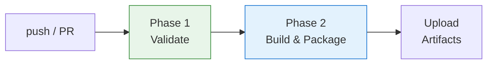

# CI/CD 流程

> 對應檔案：`.github/workflows/ci.yml`
> 觸發條件：push to `main` / PR to `main`

## 流程總覽

兩個階段採 **gate pattern**：Phase 2 必須 Phase 1 全部通過才會執行。

---

## Phase 1: Validate

所有 PR 與 push to main 都會執行，包含品質檢查與安全掃描兩大區塊。

### 品質檢查

| 步驟 | 對應指令 | 用途 |
|------|---------|------|
| Lint | `npm run lint` | ESLint 程式碼風格 |
| Type Check | `npm run typecheck` | TypeScript 型別正確性 |
| Unit Test | `npm run test:unit` | Vitest 單元測試 |
| E2E Test | `npm test` | Playwright + Chromium 端到端測試 |

### 安全掃描

| 檢查項目 | 失敗條件 | 設計考量 |
|----------|---------|---------|
| Hardcoded secrets | `.js/.ts/.json/.html` 中出現疑似 API key / token / password 的 pattern | regex 掃描，排除 `node_modules`、`.env.example` |
| .gitignore 驗證 | `.env`、`*.key`、`*.pem` 未在 .gitignore 中 | 確保敏感檔案不會被意外提交 |
| manifest.json 審計 | CSP 含 `unsafe-eval`（MV3 違規）或缺少 `version` 欄位 | 寬泛 `host_permissions` 只 warn 不 fail |
| Inline script 檢查 | HTML 中有 `` | Manifest V3 禁止 inline script |

> **Know-how**: 安全掃描嵌在 Validate 階段而非獨立 job，確保不通過時不會產生任何 artifact。

---

## Phase 2: Build & Package

### 建置流程

1. **版本同步**（`npm run prebuild`）— `package.json` 版本寫入 `manifest.json`
2. **編譯**（`npm run build`）— 產生 `dist/proxy.js`、`src/achievement-engine.js`
3. **從 manifest.json 取版本號** — 作為 artifact 命名依據

### 打包產物

產出兩個獨立 zip，分離發布便於獨立版本治理與回滾：

| 產物 | 命名規則 | 內容 | 用途 |
|------|---------|------|------|
| **Extension** | `iq-copilot-extension-${version}.zip` | `manifest.json`、`icons/`、`src/` 前端檔案 | Chrome 載入的擴充功能本體 |
| **Companion** | `iq-copilot-companion-${version}.zip` | `dist/proxy.js`、`start.sh`、`README.md` | 本機 proxy server |

#### Extension zip 打包原則

- **只包含 manifest 引用與 runtime 直接依賴檔案**
- 排除 `*.DS_Store`、`*.map`
- 打包後自動掃描確認不含 `.env` / `.key` / `.pem` 等敏感檔案

### Artifact 上傳

兩個 zip 透過 `actions/upload-artifact@v4` 上傳至 GitHub Actions，可從 workflow run 頁面下載。

---

## 觸發條件

| 事件 | Validate | Build & Package |
|------|:--------:|:---------------:|
| PR to main | ✅ | ✅ |
| Push to main | ✅ | ✅ |

---

## 維護注意事項

- **新增前端檔案** → 更新 ci.yml 中 `Package extension artifact` 的 zip 白名單
- **新增安全規則** → 加在 Validate 階段的安全掃描區塊
- **Node.js 版本** → 目前固定 `node: 20`，升級時需同步更新 ci.yml
- **manifest.json 新增資源**（script、`web_accessible_resources`）→ 同步更新打包白名單
